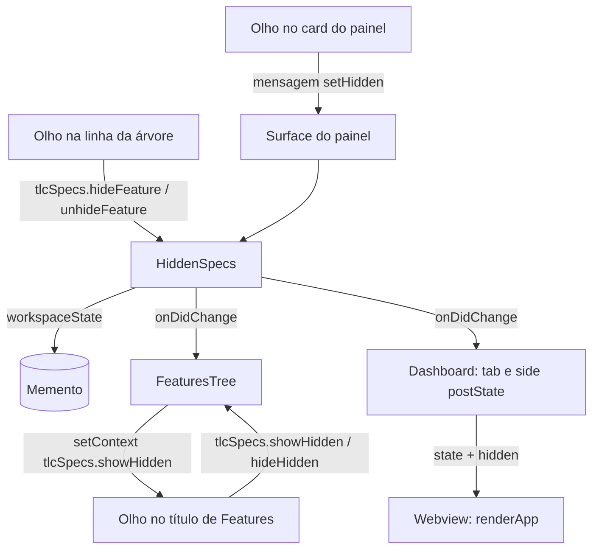

# Hidden Specs Design

**Spec**: `.specs/features/hidden-specs/spec.md`
**Status**: Approved

---

## Architecture Overview

As marcas moram num objeto do host, `HiddenSpecs`, gravado no `workspaceState`. A regra "oculta = concluída ou marcada" fica numa função pura, usada pela árvore e pelo painel. A árvore guarda o próprio olho aberto ou fechado. O painel guarda o dele no estado da webview, como o `hideDone` de hoje. Uma marca nova avisa a árvore e as duas superfícies do painel, que redesenham.



---

## Code Reuse Analysis

### Existing Components to Leverage

| Component            | Location            | How to Use                |
| -------------------- | ------------------- | ------------------------- |
| Filtro e coluna Concluídas | `src/webview/render.ts:163-176` | Troca o teste `f.health !== 'complete'` pelo `isHidden`. O `five-stages` e a coluna continuam iguais |
| `DEFAULT_VIEW` | `src/webview/render.ts:24` | Troca `hideDone: true` por `showHidden: false` |
| `actionFor` | `src/webview/render.ts:582` | Casos novos `toggle-hidden`, `hide` e `unhide`, no lugar de `toggle-done` |
| `featureActions` | `src/webview/render.ts:224` | Recebe o olho da spec no card. O ícone de "Visualizar" vira o de pré-visualização |
| `toRef` | `src/extension.ts:15` | Os comandos por spec aceitam a linha da árvore ou um `FeatureRef`, como `showFeature` |
| `Surface.onMessage` | `src/ui/dashboard.ts:67` | Caso novo `setHidden` |
| `Rendered` e `report()` | `src/core/protocol.ts:9`, `src/webview/main.ts:56` | Campo novo `toggle` com o título e o texto do olho do painel |
| Padrão de evento puro | — | `HiddenSpecs` não importa `vscode`, para rodar em `node --test`, como os módulos de `src/core` |

### Integration Points

| System         | Integration Method                      |
| -------------- | --------------------------------------- |
| `workspaceState` | Chave `tlcSpecs.hidden`, lista de chaves `projectId|feature`. O `projectId` é a URI da pasta de specs (`src/ui/store.ts:108`) |
| Context key | `tlcSpecs.showHidden`, lido pelos `when` dos botões do título de Features |
| Menus | `viewItem == feature` passa a `viewItem =~ /^feature/`, para as linhas `feature`, `feature.hidden` e `feature.done` |

---

## Components

### HiddenSpecs

- **Purpose**: Guarda as specs marcadas e avisa quem desenha quando elas mudam.
- **Location**: `src/core/hidden.ts`
- **Interfaces**:
  - `hiddenKey(projectId: string, feature: string): string` - chave `projectId|feature`, usada no host e na webview
  - `isHidden(feature: Feature, marked: boolean): boolean` - concluída ou marcada
  - `new HiddenSpecs(memento: Memento)` - lê as marcas gravadas
  - `isMarked(ref: FeatureRef): boolean`
  - `keys(): string[]` - as marcas, para a mensagem `state`
  - `set(ref: FeatureRef, hidden: boolean): Promise<void>` - grava e avisa; não avisa quando nada muda
  - `onDidChange(listener: () => void): { dispose(): void }`
- **Dependencies**: um `Memento` mínimo (`get`, `update`), que o `workspaceState` satisfaz
- **Reuses**: tipos `Feature` e `FeatureRef`

### FeaturesTree (alterado)

- **Purpose**: Filtra as ocultas enquanto o olho da árvore está fechado e marca as linhas.
- **Location**: `src/ui/featuresTree.ts`
- **Interfaces**:
  - `constructor(store: SpecsStore, hidden: HiddenSpecs)`
  - `showHidden: boolean` (leitura) e `setShowHidden(show: boolean): void` - redesenha e grava o context key
  - `hiddenCount(): number` - specs fora da árvore, para a mensagem da view
- **Reuses**: `featureNodes`, `featureItem`

### Painel (alterado)

- **Purpose**: Olho que alterna no topo, olho por card, card esmaecido.
- **Location**: `src/webview/render.ts`, `src/webview/main.ts`, `src/ui/dashboard.ts`, `media/dashboard.css`
- **Interfaces**:
  - `ViewState.showHidden: boolean` no lugar de `hideDone`
  - `RenderCtx.hidden: readonly string[]` - chaves das marcadas
  - `ToWebview` `state` ganha `hidden: string[]`
  - `FromWebview` ganha `{ type: 'setHidden'; target: FeatureRef; hidden: boolean }`
  - `Rendered.toggle: { title: string; text: string } | null`

---

## Data Models

```typescript
/** workspaceState['tlcSpecs.hidden'] */
type HiddenMarks = string[]; // hiddenKey(projectId, feature)

interface ViewState {
  selected: FeatureRef | null;
  query: string;
  /** Olho do painel aberto: as ocultas aparecem no quadro. */
  showHidden: boolean;
  expandedTasks: string[];
}
```

---

## Error Handling Strategy

| Error Scenario | Handling      | User Impact      |
| -------------- | ------------- | ---------------- |
| `workspaceState` com valor que não é lista de textos | Lê como lista vazia | Nenhuma spec marcada |
| Comando por spec sem argumento (paleta) | Os comandos por spec ficam fora da paleta | — |
| Marca de spec que não existe mais | Ignorada ao desenhar | — |

---

## Risks & Concerns

| Concern | Location (file:line) | Impact | Mitigation |
| ------- | -------------------- | ------ | ---------- |
| Testes que leem a concluída `billing-invoices` na árvore | `test/integration/suite.cjs:153-158` | Falham quando a árvore esconde as concluídas | A task da árvore abre o olho antes desses testes e o fecha depois |
| A integração não clica dentro da webview | `src/core/protocol.ts:32-34` | O clique no olho do painel só se prova pelo `actionFor` | Mesmo limite aceito no panel-in-progress. `actionFor` testado nos dois sentidos, e o `Rendered.toggle` mostra o olho real ao abrir |
| O context key não é legível pelos testes | `src/extension.ts` | Um `setContext` invertido passaria | O teste espia `vscode.commands.executeCommand('setContext', ...)` e confere os `when` do `package.json` |
| Marcas feitas num teste vazam para os seguintes | `test/integration/suite.cjs` | Cards somem de testes que contam o quadro | Cada teste desmarca o que marcou num `finally` |

---

## Tech Decisions (only non-obvious ones)

| Decision          | Choice          | Rationale     |
| ----------------- | --------------- | ------------- |
| Onde fica `HiddenSpecs` | `src/core`, sem `vscode` | Roda em `node --test`, e o HID-13 se prova com um `Memento` falso lido por uma instância nova |
| Botão do painel | `<button>` com `data-show`, no lugar da caixa | O clique passa pelo mesmo `activate` dos outros botões. O `change` da caixa sai de `main.ts` |
| Nome do estado | `showHidden` no lugar de `hideDone` | O olho agora esconde as marcadas também. Um `hideDone` antigo guardado pela webview é ignorado |
