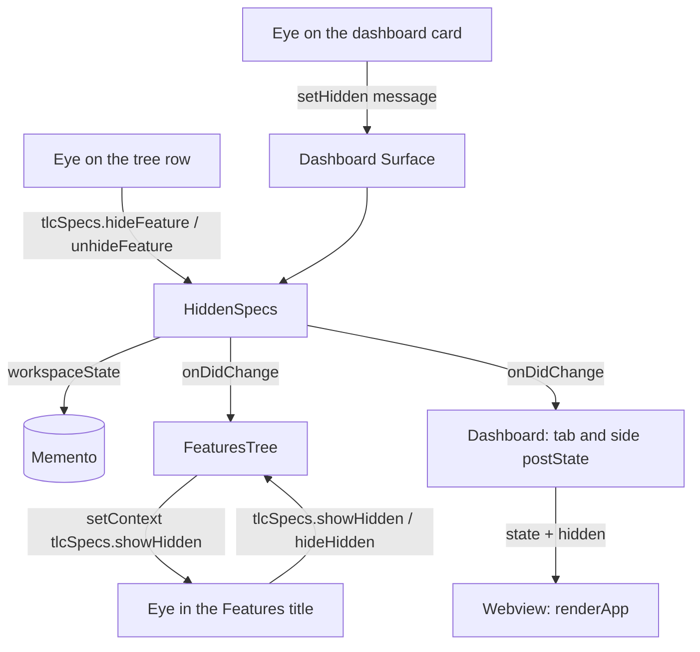

# Hidden Specs Design

**Spec**: `.specs/features/hidden-specs/spec.md`
**Status**: Approved

---

## Architecture Overview

The marks live in a host object, `HiddenSpecs`, saved to `workspaceState`. The rule "hidden = completed or marked" lives in a pure function, used by the tree and the dashboard. The tree keeps its own eye, open or closed. The dashboard keeps its eye in the webview state, like today's `hideDone`. A new mark notifies the tree and both dashboard surfaces, which redraw.



---

## Code Reuse Analysis

### Existing Components to Leverage

| Component            | Location            | How to Use                |
| -------------------- | ------------------- | ------------------------- |
| Filter and Completed column | `src/webview/render.ts:163-176` | Replaces the `f.health !== 'complete'` test with `isHidden`. `five-stages` and the column stay the same |
| `DEFAULT_VIEW` | `src/webview/render.ts:24` | Replaces `hideDone: true` with `showHidden: false` |
| `actionFor` | `src/webview/render.ts:582` | New cases `toggle-hidden`, `hide`, and `unhide`, in place of `toggle-done` |
| `featureActions` | `src/webview/render.ts:224` | Takes the spec's eye on the card. The "Preview" icon becomes the preview one |
| `toRef` | `src/extension.ts:15` | Per-spec commands accept the tree row or a `FeatureRef`, like `showFeature` |
| `Surface.onMessage` | `src/ui/dashboard.ts:67` | New `setHidden` case |
| `Rendered` and `report()` | `src/core/protocol.ts:9`, `src/webview/main.ts:56` | New `toggle` field with the title and text of the dashboard eye |
| Pure event pattern | — | `HiddenSpecs` does not import `vscode`, so it runs under `node --test`, like the `src/core` modules |

### Integration Points

| System         | Integration Method                      |
| -------------- | --------------------------------------- |
| `workspaceState` | Key `tlcSpecs.hidden`, a list of `projectId|feature` keys. The `projectId` is the specs folder URI (`src/ui/store.ts:108`) |
| Context key | `tlcSpecs.showHidden`, read by the `when` clauses of the Features title buttons |
| Menus | `viewItem == feature` becomes `viewItem =~ /^feature/`, for the `feature`, `feature.hidden`, and `feature.done` rows |

---

## Components

### HiddenSpecs

- **Purpose**: Stores the marked specs and notifies whoever draws them when they change.
- **Location**: `src/core/hidden.ts`
- **Interfaces**:
  - `hiddenKey(projectId: string, feature: string): string` - key `projectId|feature`, used in the host and in the webview
  - `isHidden(feature: Feature, marked: boolean): boolean` - completed or marked
  - `new HiddenSpecs(memento: Memento)` - reads the saved marks
  - `isMarked(ref: FeatureRef): boolean`
  - `keys(): string[]` - the marks, for the `state` message
  - `set(ref: FeatureRef, hidden: boolean): Promise<void>` - saves and notifies; does not notify when nothing changes
  - `onDidChange(listener: () => void): { dispose(): void }`
- **Dependencies**: a minimal `Memento` (`get`, `update`), which `workspaceState` satisfies
- **Reuses**: `Feature` and `FeatureRef` types

### FeaturesTree (changed)

- **Purpose**: Filters out the hidden specs while the tree eye is closed, and marks the rows.
- **Location**: `src/ui/featuresTree.ts`
- **Interfaces**:
  - `constructor(store: SpecsStore, hidden: HiddenSpecs)`
  - `showHidden: boolean` (read-only) and `setShowHidden(show: boolean): void` - redraws and writes the context key
  - `hiddenCount(): number` - specs left out of the tree, for the view message
- **Reuses**: `featureNodes`, `featureItem`

### Dashboard (changed)

- **Purpose**: Toggle eye at the top, per-card eye, dimmed card.
- **Location**: `src/webview/render.ts`, `src/webview/main.ts`, `src/ui/dashboard.ts`, `media/dashboard.css`
- **Interfaces**:
  - `ViewState.showHidden: boolean` in place of `hideDone`
  - `RenderCtx.hidden: readonly string[]` - keys of the marked specs
  - `ToWebview` `state` gains `hidden: string[]`
  - `FromWebview` gains `{ type: 'setHidden'; target: FeatureRef; hidden: boolean }`
  - `Rendered.toggle: { title: string; text: string } | null`

---

## Data Models

```typescript
/** workspaceState['tlcSpecs.hidden'] */
type HiddenMarks = string[]; // hiddenKey(projectId, feature)

interface ViewState {
  selected: FeatureRef | null;
  query: string;
  /** Dashboard eye open: the hidden specs show on the board. */
  showHidden: boolean;
  expandedTasks: string[];
}
```

---

## Error Handling Strategy

| Error Scenario | Handling      | User Impact      |
| -------------- | ------------- | ---------------- |
| `workspaceState` holding a value that is not a list of strings | Read as an empty list | No spec marked |
| Per-spec command without an argument (palette) | Per-spec commands are left out of the palette | — |
| Mark for a spec that no longer exists | Ignored when drawing | — |

---

## Risks & Concerns

| Concern | Location (file:line) | Impact | Mitigation |
| ------- | -------------------- | ------ | ---------- |
| Tests that read the completed `billing-invoices` in the tree | `test/integration/suite.cjs:153-158` | They fail once the tree hides completed specs | The tree task opens the eye before these tests and closes it after |
| Integration does not click inside the webview | `src/core/protocol.ts:32-34` | The click on the dashboard eye is proven only through `actionFor` | Same limit accepted in panel-in-progress. `actionFor` tested both ways, and `Rendered.toggle` shows the real eye on open |
| The context key is not readable by tests | `src/extension.ts` | An inverted `setContext` would pass | The test spies on `vscode.commands.executeCommand('setContext', ...)` and checks the `when` clauses in `package.json` |
| Marks made in one test leak into the next | `test/integration/suite.cjs` | Cards vanish from tests that count the board | Each test unmarks what it marked in a `finally` |

---

## Tech Decisions (only non-obvious ones)

| Decision          | Choice          | Rationale     |
| ----------------- | --------------- | ------------- |
| Where `HiddenSpecs` lives | `src/core`, without `vscode` | Runs under `node --test`, and HID-13 is proven with a fake `Memento` read by a new instance |
| Dashboard button | `<button>` with `data-show`, in place of the checkbox | The click goes through the same `activate` as the other buttons. The checkbox `change` handler leaves `main.ts` |
| State name | `showHidden` in place of `hideDone` | The eye now hides the marked specs too. An old `hideDone` saved by the webview is ignored |
