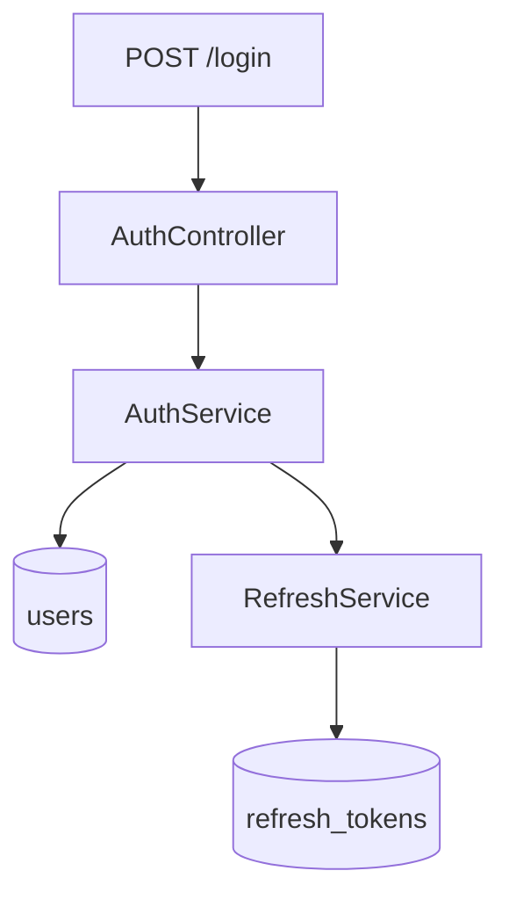

# User Authentication Design

**Spec**: `.specs/features/user-auth/spec.md`
**Status**: Approved

---

## Architecture Overview

Stateless JWT access tokens; refresh tokens persisted with a family id so reuse can revoke the whole chain.

---

## Components

### AuthService

- **Purpose**: Verifies credentials and issues token pairs
- **Location**: `src/auth/auth.service.ts`
- **Interfaces**:
  - `login(email: string, password: string): TokenPair`
- **Dependencies**: UsersRepository, RefreshService
- **Reuses**: `src/shared/crypto.ts`

### RefreshService

- **Purpose**: Rotates refresh tokens and detects reuse
- **Location**: `src/auth/refresh.service.ts`
- **Interfaces**:
  - `rotate(token: string): TokenPair`
- **Dependencies**: RefreshTokenRepository
- **Reuses**: none

---

## Risks & Concerns

| Concern | Location (file:line) | Impact | Mitigation |
| ------- | -------------------- | ------ | ---------- |
| Password hashing uses sha256 | `src/shared/crypto.ts:12` | Weak hashes | T1 switches to argon2id |

---

## Tech Decisions (only non-obvious ones)

| Decision          | Choice          | Rationale     |
| ----------------- | --------------- | ------------- |
| Token family | UUID per login | Enables reuse detection (AD-003) |
